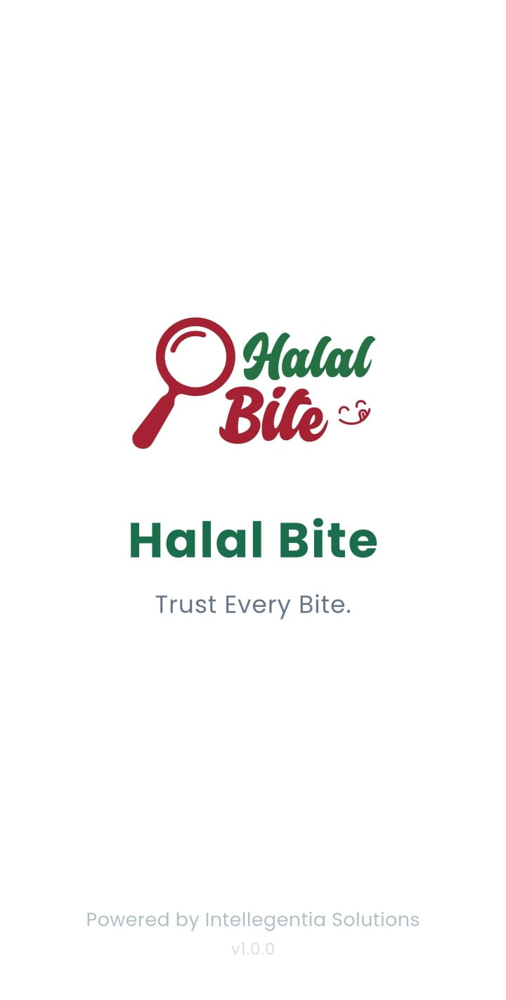
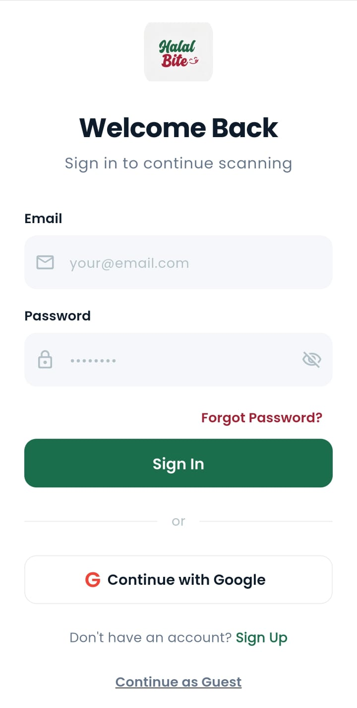
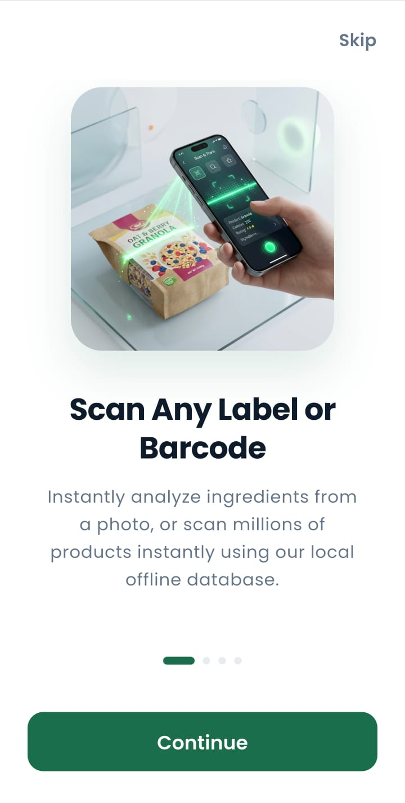
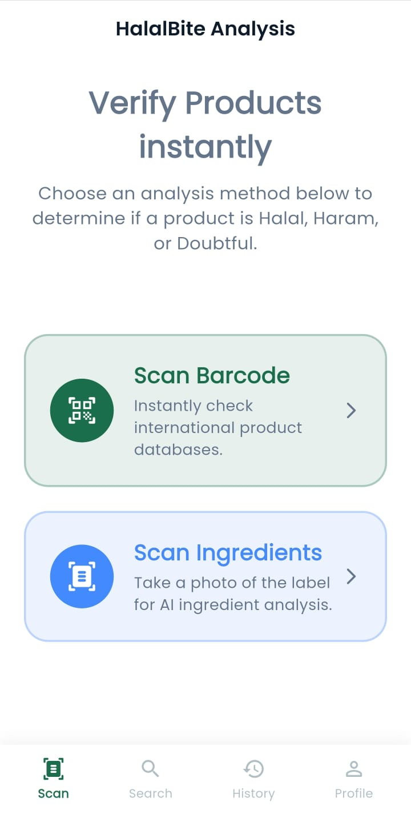
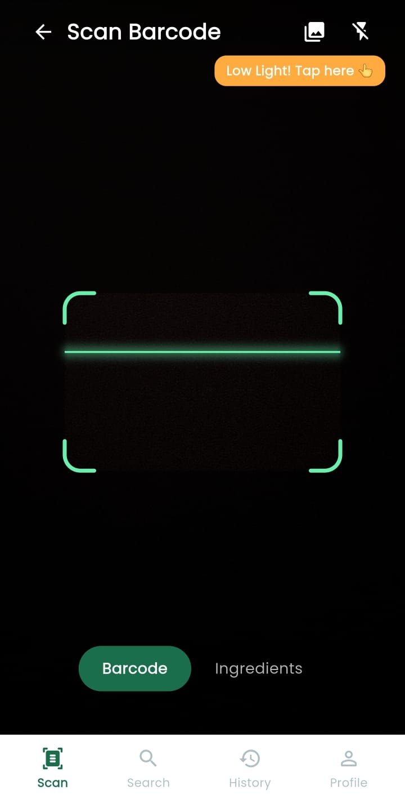
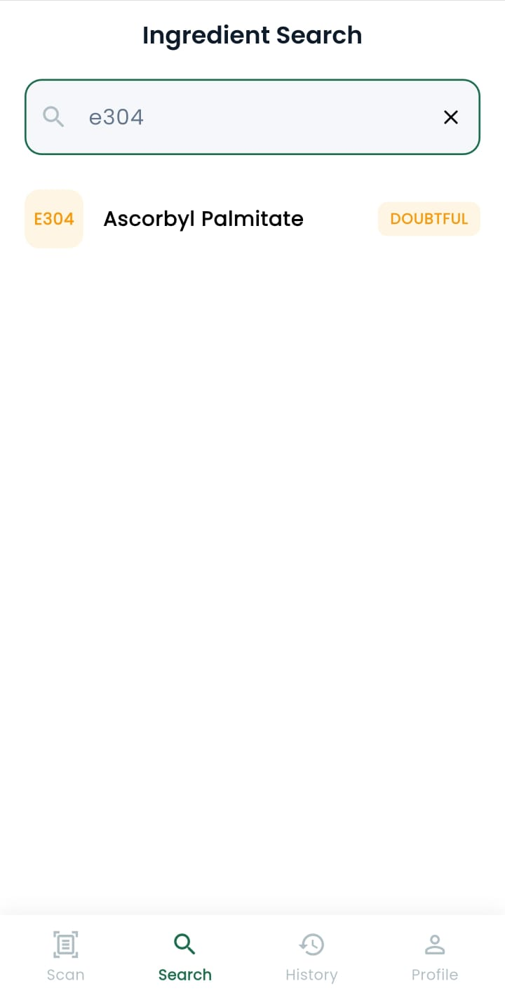
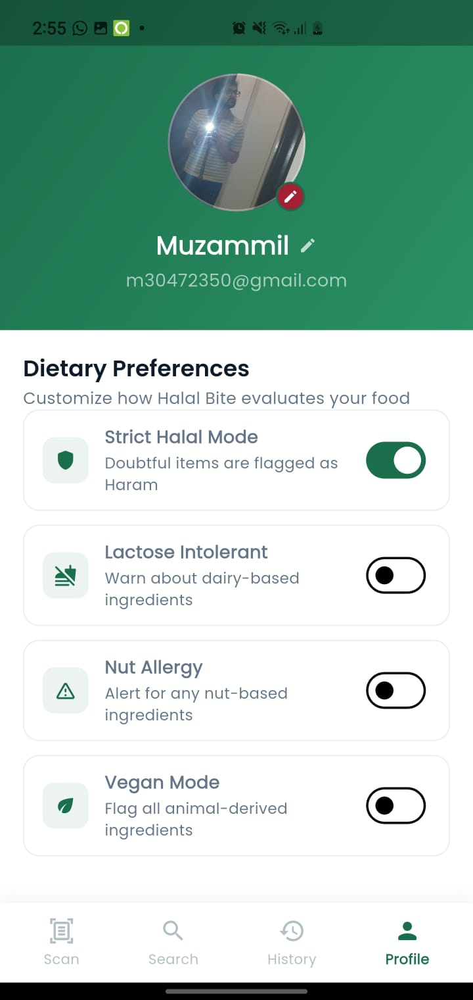
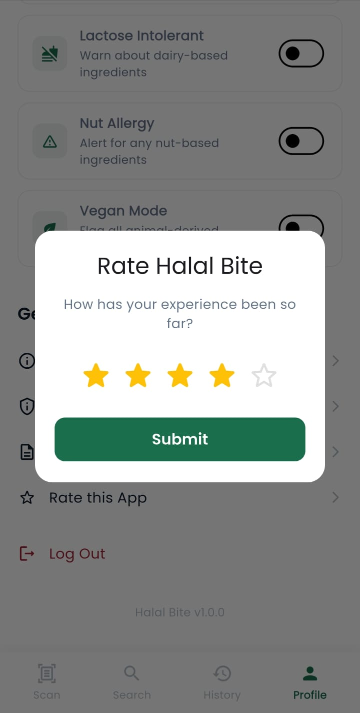

<p align="center">
  
</p>

<h1 align="center">Halal Bite - A Smart Dietary Scanner 🥩🔍</h1>

<p align="center">
  
  
  
  
  
  
  
  
  
  
</p>

---

## 📖 About The Project

**Halal Bite** is a cross-platform mobile application that simplifies the process of identifying whether packaged food products are Halal, Haram, or Mushbooh (doubtful). It uses on-device OCR and AI-driven classification to instantly analyze product ingredients, saving users from reading complex chemical names and food additives. 

Whether you are strictly monitoring Halal dietary laws, are lactose intolerant, or following a vegan lifestyle, Halal Bite tailors the scanning results to your personalized profile.

## ✨ Key Features

- **📸 Smart OCR Scanner:** Uses Google ML Kit to extract raw ingredient text directly from product packaging in real-time.
- **🤖 AI-Powered Classification:** Integrates Google Gemini AI to analyze complex scientific ingredient names, E-numbers, and aliases to accurately classify them.
- **⚙️ Personalized Dietary Profiles:** Users can enable specialized alerts (Strict Halal Mode, Vegan Mode, Lactose Intolerant, Nut Allergy).
- **☁️ Cloud Sync & Auth:** Secure login using Firebase Auth (Email/Google), with data seamlessly synced via Cloud Firestore.
- **📴 Offline Support:** Utilizes Isar Database for blazing-fast local caching and offline history access.

---

## 🛠️ Tech Stack & Architecture

This project was built focusing on modern app development practices, scalability, and robust state management.

* **Frontend:** Flutter (Dart)
* **State Management:** Riverpod 
* **Backend / BaaS:** Firebase (Authentication, Firestore, Cloud Storage)
* **Machine Learning:** Google ML Kit (Text Recognition API)
* **Generative AI:** Google Gemini AI API (`gemini-3-flash`)
* **Local Database:** Isar Database (NoSQL)
* **Routing:** GoRouter

---

## 🚧 Current Status & ML Accuracy

The core application flow (Authentication, Database Sync, UI/UX, Profile Management) is fully complete and stable. 

**Machine Learning & Scanning (Beta Phase):**
Currently, the OCR ingredient scanning and AI classification system is in its beta phase. While functional, the extraction of curved or poorly lit text from packaging can sometimes result in slightly inaccurate AI predictions. 
We are continuously working on improving the image pre-processing pipeline and fine-tuning the prompt engineering for the Gemini API to yield much higher accuracy and reliability in future updates. It's a continuous learning process!

---

## 🚀 Future Roadmap & Improvements

- [ ] **Enhanced OCR Accuracy:** Implement OpenCV-based image straightening and contrast enhancement before passing the image to ML Kit.
- [ ] **Barcode Integration:** Integrate OpenFoodFacts API for instant barcode lookup alongside OCR.
- [ ] **Multi-Language Support:** Re-introduce localization (Urdu/Arabic) for a wider audience.
- [ ] **Community Contributions:** Allow users to flag incorrect ingredients to train a custom backend classification model.

---

## 💻 How to Run Locally

1. **Clone the repository:**
   ```bash
   git clone https://github.com/yourusername/clearbite_app.git
   ```
2. **Install dependencies:**
   ```bash
   cd clearbite_app
   flutter pub get
   ```
3. **Environment Setup:**
   Create a `.env` file in the root directory and add your Gemini API Key:
   ```env
   GEMINI_API_KEY=your_api_key_here
   ```
4. **Run the App:**
   ```bash
   flutter run
   ```

---
<p align="center">Developed with ❤️ by Muzzammil Ahmed</p>
